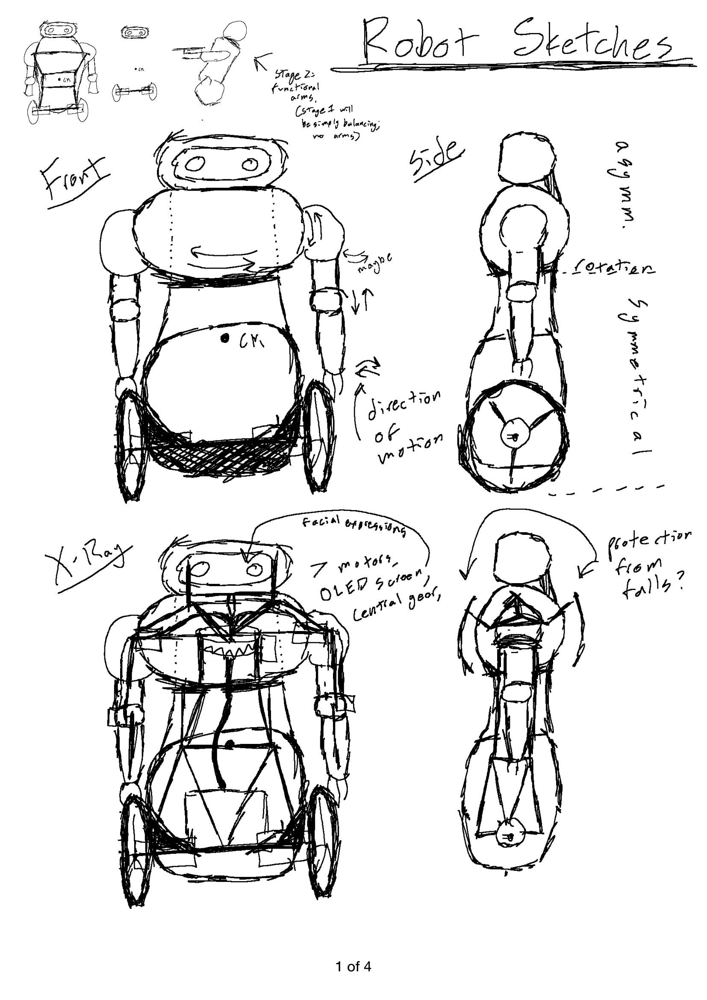

# Balancing Robot Project 

## Overview

To explore the world of machine learning in robotics, I'm interested in building a robot that can balance itself upright on 2 wheels. This isn't for profit or glory of any kind, it'll simply be a fantastic case of project-based learning (a teaching method that I'll promote till the end of time). 

### Goals:
1. Learn new things! (Electronics, Robotics, Reinforcement Learning, Complex 3D assemblies)
2. Make something cool and unique, something that colleges and potentially internships would be interested in.
3. Practice collaborating with others on a big project like this. (It's been tough to find other CS-inclined people at our school, so all my projects previously have been on my own.)

### Specifications
This project is interdisciplinary at its core. It's going to be a lot of programming, a lot of 3D design, and a lot of machine learning. And, in the event that I find someone who'd like to pursue this with me, it'd be a lot of communication and collaboration. I'll give a brief overview of the tasks needed for each discipline below:

#### Programming:
 - The 'brain' of the robot will be the machine learning model running on a Raspberry Pi. The only programming-related tasks for that will be figuring out how to get it running on the tiny computer.
 - Additionally, we'll have an Arduino that converts the brain's commands to motor-control instructions.
 - Most of the work here will be learning how to make the Arduino communicate with the motors and Raspberry Pi.
 - This should be straightforwards; nothing here is revolutionary, so worst-case we can just follow some youtube tutorial online.

#### 3D Design
 - I've already made sketches of what I think the robot will look like. My task now is to remake it in SolidWorks (quick enough, for me).
 - I'll also need to create the simplified 3D model that will function as the 'agent' in the machine learning task.
 - Once I've designed it, I'll simply buy the materials and assemble the structure, including mounting points for the motors, electronics, and later outer-casing
 - For the beginning at least, the robot will be naked so the electronics are easy to access. Once we've got a balancing prototype, then I'll build and 3D-print the outside armor.
 - Original sketches (see `sketches/`):

 

#### Machine Learning:
 - This is the interesting stuff.
 - We're going to use an existing Reinforcment-learning framework (such as OpenAI's Gym) to train the 'brain' of our robot.
 - This requires us setting up a simulation for an 'agent' (a virtual version of the robot) to roll around in. This will need some basic physics done using PyBullet.
 - We'll then need to define how we want the robot to behave. We'll reward it for actions like remaining upright, and following movement commands.
 - Machine learning is fairly straightforward at this level (just a lot of vocab words). And again, there's probably a tutorial of someone doing a similar project that we could follow if we get lost.

## Task Breakdown
#### Ryan's Tasks (Engineering, 3D Modeling, and Machine Learning)
 - 3D Modeling and Construction:
     - Design 3D models of the robot components.
     - Buy/Print materials and assemble the physical robot once robotics system is tested.
  
 - Design robotics system
     - Decide on motors, sensors, and power equipment needed.
     - Buy equipment, make schematics.

 - Build Reinforcement Learning Model:
     - Set up the simulation environment (e.g., OpenAI Gym).
     - Define the states, actions, and reward function.

#### Adrian's Tasks (Programming and Physics)

 - Arduino Programming:
     - Develop code for motor control.
     - Retrieve data from sensors.

 - Design physics simulation in Python:
     - Learn Python and PyBullet
     - Take 3D model (made by me) and test its movements in the simulation

#### Shared Tasks (Integration and Testing):

 - Test robotics system
     - Plug everything in based on the schematics.
     - Test sensors and motor movements.
  
 - Testing and Debugging
     - Transfer trained ML model to Raspberry Pi.
     - Test movement abilities and adjust model as necessary.

## Tentative Timeline (with estimated time):

#### <ins>September</ins>:
##### Ryan (Designing): 
 - Build 3D models of robot components (20 hours).
 - Plan robotics system, buy electronics once finalized (10 hours).
##### Adrian (Python): 
 - Learn basic python syntax (1-10 hours depending on familiarity).
 - Learn about the PyBullet physics simulation library, follow some tutorials (10 hours).

#### <ins>October</ins>:
##### Ryan (Assembly and RL): 
 - Buy parts and assemble the physical robot (without electronics for now) (20 hours).
 - Design model for Reinforcement Learning (4 hours).
 - Define states, actions, and reward functions in the simulation environment (5 hours).
##### Adrian (Physics): 
 - Build physics simulation (12 hours).
 - Set up Raspberry Pi to host machine learning model (2 hours).

#### <ins>November</ins>:
##### Ryan (Training): 
 - Integrate physics simulation with reinforcment learning library (10 hours).
 - Train model and do a ton of testing (20 hours).
 - Make Arduino code to control facial expressions (OLED screen) (4 hours).
##### Adrian (Arduino): 
 - Develop basic motor, sensor, and remote control system code for the Arduino--Follow online tutorials if wanted (10 hours).
 - Test code with physical Components (5 hours).

#### <ins>December</ins>:
##### Both (Integration and Testing): 
 - Put machine learning model into robot and test it.
 - Debug code if needed (Adrian).
 - Re-train model/rebuild simulation if needed (Ryan).
 - Document project and results, make videos if wanted.

#### <ins>January</ins>:
 - Put it on college applications

#### <ins>2nd Semester?</ins>
 - Arm movement (complicates physics simulation and training)
 - Outer body (complicates 3D design and printing)
 - Have robot grab a diploma on stage at Red Rocks

### Summary of Hours:

#### September:
 - Ryan: 30 hours
 - Adrian: ~15 hours

#### October:
 - Ryan: 29 hours
 - Adrian: 14 hours

#### November:
 - Ryan: 34 hours
 - Adrian: 15 hours

#### December:
 - Both: Unknown

#### Averages:
 - Ryan: 93 hours / 12 weeks = ~8 hours/week
 - Adrian: 44 hours / 12 weeks = ~4 hours/week
